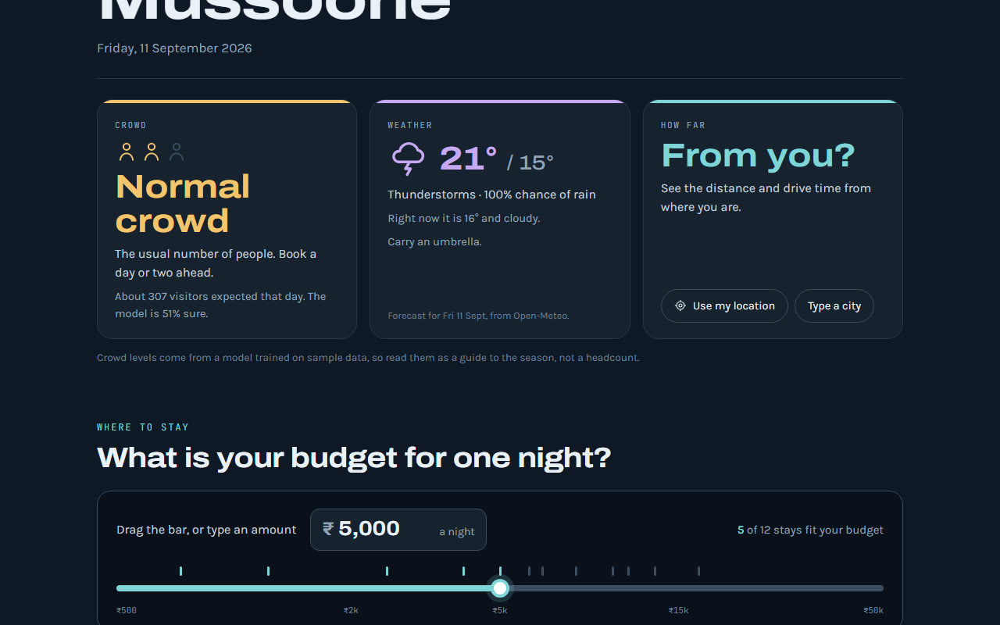
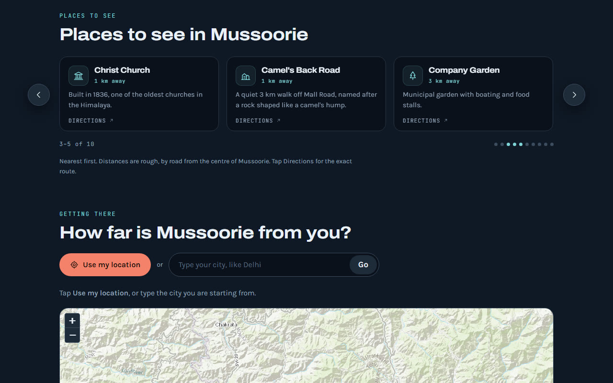
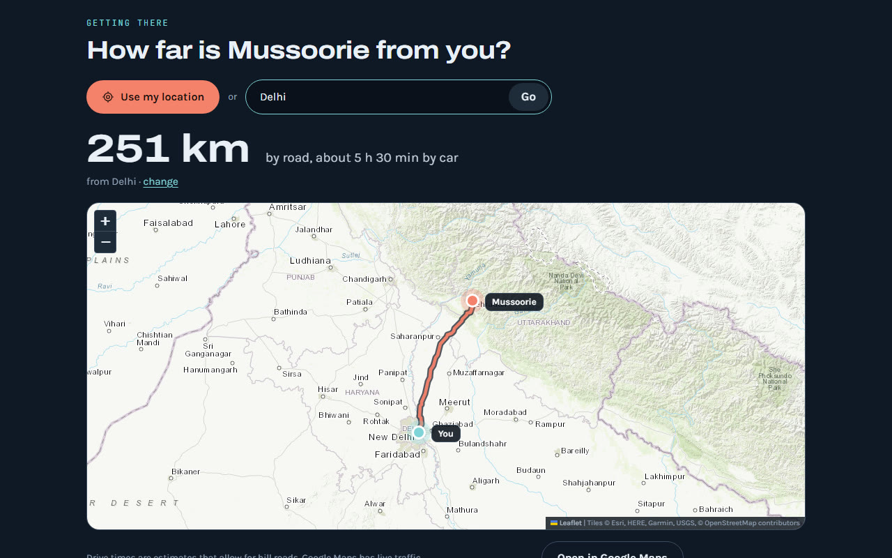
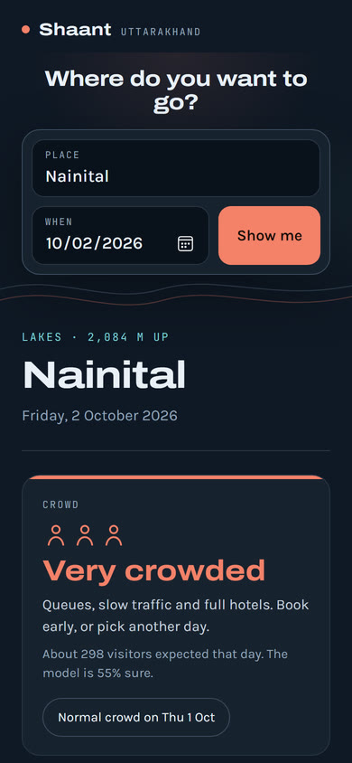
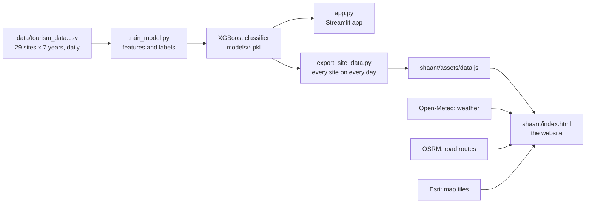

# Shaant

**Know the rush before you go.** Type a place in Uttarakhand and one page tells you how crowded it will be on your date, what the weather will do, which hotels fit your budget, what to see there, and how far it is from you.

**Live site: https://shaant.netlify.app**

The page opens with a scroll-driven film: scrolling down drops you through the clouds onto a still mountain lake, where the search box waits. Phones get a still picture of the lake instead. The planner underneath works exactly as shown below.


## Contents

- [What it does](#what-it-does)
- [How it works](#how-it-works)
- [The model](#the-model)
- [The website](#the-website)
- [Tech stack](#tech-stack)
- [Project structure](#project-structure)
- [Run it yourself](#run-it-yourself)
- [Limitations](#limitations)
- [Credits](#credits)

## What it does

| Step | What you get |
|---|---|
| **Search** | Type a place. Spelling is forgiven: "massori" finds Mussoorie, and "kempty" finds Kempty Falls in Mussoorie. |
| **Crowd** | Not crowded, Normal crowd or Very crowded for your date, from the trained model, with a quieter day nearby when there is one. |
| **Weather** | The live forecast up to 16 days ahead, the same week last year for dates further out, and a line on what to carry. |
| **Where to stay** | Drag the budget bar or type an amount. The stays that fit are ranked by how well they match it, top 10, three at a time. |
| **Places to see** | The best places in that destination, nearest first, each with a Google Maps link. |
| **Getting there** | From your location or a typed city: the road distance, a drive time that allows for hill roads, and the route on a map. |

It covers 29 destinations in Uttarakhand, with crowd forecasts from 1 September 2026 to 31 December 2028.

<p>
  
  
  
  
</p>
<p align="center"></p>

## How it works



The model is Python, and a browser cannot run it. So `export_site_data.py` asks it every question the website can ask, ahead of time: 29 destinations on each of 853 days. The answers are packed into a 107 KB JavaScript file. The website then needs no server of its own: open `shaant/index.html` straight from disk, or host the folder on any static host. Weather, routes and map tiles come from free public services when the page is viewed.

The same model also powers `app.py`, a Streamlit app. The website and the app give the same answer for the same place and date; a check of 300 random site-days found no disagreements.

## The model

### The data

`data/tourism_data.csv` has 74,153 rows: one per destination per day, for 29 destinations from 1 January 2018 to 31 December 2024. No values are missing.

| Column | Meaning |
|---|---|
| `site` | destination name |
| `date` | the day |
| `tourists` | visitors that day (10 to 486, average 250) |
| `temp` | temperature in °C |
| `precip` | rainfall in mm |
| `event_count` | events happening that day |
| `trend_score` | search interest, 0 to 100 |

### Labels

Each day is labelled by its visitor count against the whole dataset's quartiles:

| Label | Rule | Share |
|---|---|---|
| Mild | fewer than 198 visitors (the 25th percentile) | 25% |
| Suitable | 198 to 302 visitors | 50% |
| Overcrowded | more than 302 visitors (the 75th percentile) | 25% |

### Features

The model sees nine features for each destination and date. Five of them summarise that destination's history on the same calendar day across every year in the data, which is how a date in 2027 gets a value.

| Feature | Meaning |
|---|---|
| `month`, `weekday` | where the date falls in the calendar |
| `is_holiday` | an Indian public holiday, from the `holidays` library |
| `site` | the destination, as a number (`LabelEncoder`) |
| `hist_avg_tourists` | average visitors on this calendar day at this destination |
| `hist_avg_temp`, `hist_avg_precip` | average weather on this calendar day |
| `hist_event_count`, `hist_trend_score` | average events and search interest on this calendar day |

### Algorithm

An XGBoost gradient-boosted tree classifier (`XGBClassifier`, multi-class soft probabilities) with the library defaults: 100 boosting rounds per class, so 300 trees in all, a maximum depth of 6 and a learning rate of 0.3. It is trained on a stratified 80/20 split with `random_state=42`. Each tree corrects the errors left by the trees before it, and the final answer is the class with the highest probability. That probability is shown as the model's confidence.

### Results

On the held-out test split of 14,831 days:

| Measure | Value |
|---|---|
| Accuracy | 57.2% |
| Macro F1 | 0.56 |
| Always guessing "Suitable" | 50.1% |
| Share of the model's gain from `hist_avg_tourists` | 77% |

Read those numbers together with the [limitations](#limitations): the history feature includes the day being predicted, and the dataset is synthetic.

## The website

Everything lives in `shaant/`, and it is three files:

| File | What it holds |
|---|---|
| `index.html` | the page: HTML, CSS and plain JavaScript, no framework and no build step |
| `assets/data.js` | the model's answers, written by `export_site_data.py` |
| `assets/places.js` | the 29 destinations: coordinates, altitude, 158 places to see and 118 stays |

How the main parts work:

- **Search.** Every place name, a few aliases and every place to see go into an index. A query is matched in steps: exact, starts with, a word starts with, contains, then a spelling-free "sound key" (keep the first letter, drop vowels and h, squash doubled letters, so "massori" and "mussoorie" both become `msr`), then edit distance. The best score wins.
- **Crowd.** A lookup, not a calculation: the day's letter (M, S or O) and the model's confidence are read from `data.js` by counting days from 1 September 2026.
- **Weather.** Up to 16 days ahead: the Open-Meteo forecast. Further out: the same seven days last year from the Open-Meteo archive. With no internet: a typical monthly table, adjusted by 6.5 °C for every 1,000 m of altitude.
- **Where to stay.** A stay fits when its cheapest room is within your budget. Stays whose price range takes in your budget come first, then the ones just under it. The bar is logarithmic, so ₹500 to ₹5,000 gets as much room as ₹5,000 to ₹50,000.
- **Carousels.** A CSS scroll-snap row with arrow buttons that step one card at a time and wrap round at the ends. Swipe works on phones.
- **Route.** The OSRM route service gives the road distance and a drive time. That drive time assumes open roads at the speed limit, so the page uses 1.35 times it, plus 25 minutes for every 1,000 m of climb. The map is Leaflet with Esri topographic tiles, falling back to OpenTopoMap.

## Tech stack

| Part | Tools |
|---|---|
| Model | Python 3.12, pandas, NumPy, scikit-learn (label encoding, split, metrics), XGBoost, joblib, holidays |
| App | Streamlit, Matplotlib, the Visual Crossing weather API (optional) |
| Website | HTML, CSS, plain JavaScript, Leaflet 1.9.4 |
| Live data | Open-Meteo (forecast, archive, geocoding, elevation), OSRM (routes), Esri World Topo and OpenTopoMap (map tiles) |
| Hosting | GitHub Pages, from the `gh-pages` branch |

## Project structure

```text
.
├── shaant/                  the website
│   ├── index.html
│   ├── READ-ME-FIRST.txt
│   └── assets/
│       ├── data.js          the model's answers, precomputed
│       └── places.js        destinations, places to see, stays
├── data/
│   ├── tourism_data.csv     the raw daily dataset
│   └── processed_data.csv   features and labels, written by train_model.py
├── models/                  the trained classifier and its two label encoders
├── utils/
│   ├── preprocess.py        loading data and building the nine features
│   ├── fetch_weather.py     Visual Crossing weather, used by the app
│   ├── fetch_events.py      NewsAPI helper, not wired into the app
│   ├── fetch_trends.py      Google Trends helper, not wired into the app
│   └── visualize.py         the app's history chart
├── screenshots/             images for this README
├── app.py                   the Streamlit app
├── train_model.py           builds features, labels, trains and saves the model
├── export_site_data.py      writes shaant/assets/data.js from the model
├── requirements.txt
└── run_app.bat              starts the app on Windows
```

## Run it yourself

### The website

Double-click `shaant/index.html`. It opens in your browser and works. The crowd, stays and places work offline; the weather, the map and the route need an internet connection.

### The Streamlit app

Needs Python 3.10 or newer.

```bash
python -m pip install -r requirements.txt
python -m streamlit run app.py
```

On Windows you can double-click `run_app.bat` instead. For live weather in the app, copy `.env.example` to `.env` and add a free Visual Crossing key. The app saves your last 10 searches to `data/trip_history.json`, on your computer only.

### Retrain and republish

```bash
python train_model.py        # rebuilds data/processed_data.csv and models/*.pkl
python export_site_data.py   # rewrites shaant/assets/data.js from the new model
```

`export_site_data.py` takes `--start` and `--end` dates to change the forecast range. To publish the website, commit, then push the `shaant/` folder to the `gh-pages` branch:

```bash
git fetch origin gh-pages
git push origin "$(git commit-tree HEAD:shaant -p origin/gh-pages -m 'Publish the site'):refs/heads/gh-pages"
```

## Limitations

- **The data is synthetic.** Each month averages either about 200 or about 300 visitors, the destinations differ from each other by fewer than 4 visitors on average, and weekdays make no difference. So the model can tell a busy month from a quiet one, but it cannot tell Nainital from Auli. Real visitor records would fix that without changing the website.
- **The history feature leaks the answer.** `hist_avg_tourists` averages every year for that destination and calendar day, including the day being predicted. With that day's own visitors taken out of the average, test accuracy falls from 57.2% to 47.2%. Predicting 2024 using only 2018 to 2023 gives 49.7%. Both are about the same as always guessing "Suitable".
- **Hotel names and prices come from general knowledge**, not a live source. Only well-known stays are named, and every card links to its current price.
- **Drive times are estimates.** Google Maps, one tap away on the page, has live traffic.
- **Coordinates are approximate**, to within a few hundred metres, and distances to places to see are rounded.

## Credits

Weather, geocoding and elevation by [Open-Meteo](https://open-meteo.com/) (CC BY 4.0). Routes by the [OSRM](https://project-osrm.org/) demo server. Map tiles by Esri and [OpenTopoMap](https://opentopomap.org/). Map data © [OpenStreetMap](https://www.openstreetmap.org/copyright) contributors. Maps drawn with [Leaflet](https://leafletjs.com/).
